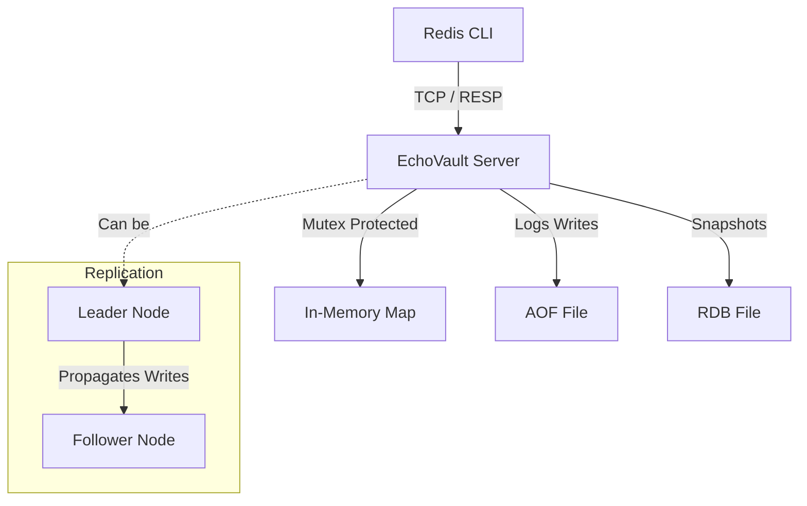

# EchoVault 🔐

A high-performance, distributed in-memory key-value store. It is designed to be wire-compatible with the **Redis Protocol (RESP)**, meaning you can use the standard `redis-cli` to interact with it.

## ⚡️ Key Features

- **Redis Compatibility**: Speaks raw RESP (Redis Serialization Protocol) over TCP.
- **Concurrency**: Uses lightweight Goroutines and Mutexes to handle thousands of concurrent connections.
- **Persistence**:
    - **AOF (Append Only File)**: Logs every write command for durability.
    - **RDB (Snapshots)**: Automatic background snapshots every 5 minutes, plus manual `BGSAVE`.
- **Replication**: Supports Leader-Follower architecture for high availability.
- **Transactions**: Supports atomic `MULTI`/`EXEC` command buffering.
- **Expiration**: Passive key eviction with TTL support (`EX`).

## 📦 Installation

**Prerequisites**

- **Go** (v1.21 or higher)
- **Redis CLI** (Optional, for testing)

**Build**

Clone the repository and build the binary:

```bash
go mod tidy

go build -o echovault .
```

## 🚀 Running the Server

1. **Standalone Mode (Default)**

Starts the server on the default port `6379`. It will automatically load data from `database_6379.rdb` and `database_6379.aof` if they exist.

```bash
go run .
```

2. **Custom Port**

Run multiple instances on the same machine.

```bash
go run . --port 6380
```

3. **Replication Mode (Leader-Follower)**

To create a distributed cluster, start a Leader, then start a Follower that replicates it.

**Terminal 1 (Leader)**

```bash
go run . --port 6379
```

**Terminal 2 (Follower):**

```bash
go run . --port 6380 --replicaof "localhost 6379"
```

*Note: Writes to the Leader will automatically propagate to the Follower.*

## 🎮 Usage Examples

You can interact with EchoVault using `netcat` or the standard `redis-cli`.

**Basic Operations**

```bash
$ redis-cli -p 6379

127.0.0.1:6379> SET user:1 "Alice"
OK
127.0.0.1:6379> GET user:1
"Alice"
127.0.0.1:6379> DEL user:1
(integer) 1
```

**Key Expiration (TTL)**

```bash
127.0.0.1:6379> SET session "active" EX 10
OK
# Wait 10 seconds...
127.0.0.1:6379> GET session
(nil)
```

**Transactions**

Commands inside a transaction block are buffered and executed atomically.

```bash
127.0.0.1:6379> MULTI
OK
127.0.0.1:6379> SET a 100
QUEUED
127.0.0.1:6379> SET b 200
QUEUED
127.0.0.1:6379> EXEC
1) OK
2) OK
```

**Persistence**

EchoVault automatically saves RDB snapshots every 5 minutes. You can also trigger a manual background save:

```bash
127.0.0.1:6379> BGSAVE
"Background saving started"
```

## 🏗️ Architecture



## 🧪 Supported Commands

| Command | Syntax | Description |
|---------|--------|-------------|
| `PING` | `PING [message]` | Returns `PONG`, or echoes the provided message. |
| `SET` | `SET key value [EX seconds]` | Sets a key to a string value. Optionally set expiration in seconds. |
| `GET` | `GET key` | Returns the value of a key, or `(nil)` if it doesn't exist or has expired. |
| `DEL` | `DEL key` | Deletes a key. Returns `1` if deleted, `0` if key didn't exist. |
| `BGSAVE` | `BGSAVE` | Triggers a background RDB snapshot save. |
| `MULTI` | `MULTI` | Starts a transaction block. Subsequent commands are queued. |
| `EXEC` | `EXEC` | Executes all queued commands atomically. Returns array of results. |
| `DISCARD` | `DISCARD` | Discards all queued commands and exits transaction mode. |

## 📁 Data Files

EchoVault stores data in port-specific files:

| File | Description |
|------|-------------|
| `database_<port>.rdb` | Binary snapshot of the database (compact, fast to load) |
| `database_<port>.aof` | Append-only log of write commands (for durability) |

On startup, EchoVault loads the RDB snapshot first, then replays the AOF to recover any writes since the last snapshot.

## 🛠️ Configuration Options

| Flag | Default | Description |
|------|---------|-------------|
| `--port` | `6379` | Port to listen on |
| `--replicaof` | `""` | Connect as replica to a leader (format: `"host port"`) |

